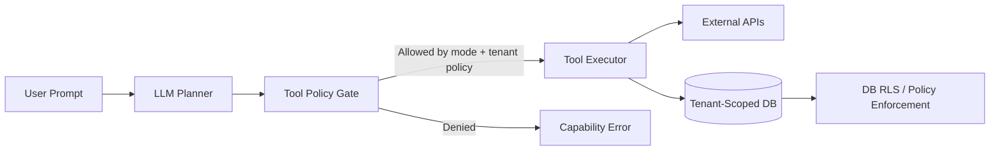
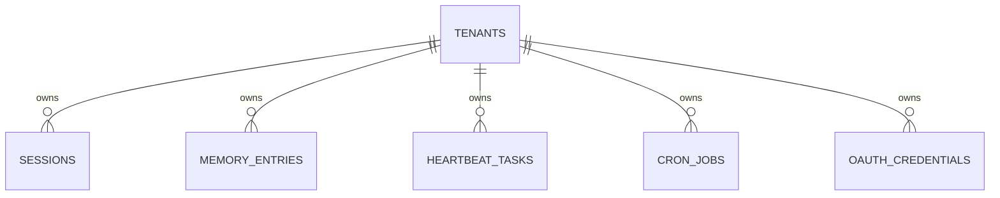

# Multi-Tenant Security Model (SaaS vs Self-Hosted)

Status: Proposed architecture and rollout plan.

## Why This Exists

For multi-tenant SaaS, the critical risk is prompt-controlled abuse:

- "delete everything"
- "run rm -rf /"
- "use python/perl/find to wipe all files"

The key principle is:

`LLM output is not a security boundary.`

Prompts influence planning. Actual damage is constrained only by the runtime capabilities we grant (tools, credentials, storage, network).

## First-Principles Model

Security is bounded by authority, not instruction quality.

`max_damage <= granted_capabilities`

If shell/filesystem/code-exec are available, a determined prompt attacker can usually find a bypass path.
If those capabilities do not exist in SaaS mode, destructive local actions are impossible by construction.

## Core Decision

Use two explicit deployment modes:

- `self_hosted` (power-user mode): full toolset including shell/filesystem, with container hardening.
- `saas` (multi-tenant mode): curated API-only toolset, no shell/filesystem/arbitrary code execution.

This is capability separation, not prompt filtering.

## Trust Boundary Map



Security boundary is `Tool Policy Gate + Tenant-Scoped Auth + Data Policies`, not the LLM prompt or system prompt.

## Tool Surface by Mode

| Tool / Capability | self_hosted | saas |
|---|---|---|
| shell | enabled (hardened) | disabled |
| filesystem read/write/edit/list | enabled (workspace-scoped) | disabled |
| arbitrary local process execution | enabled/limited | disabled |
| web fetch/search | enabled | enabled |
| WhatsApp API | enabled | enabled |
| Google Sheets API | enabled | enabled |
| message channel send | enabled | enabled |
| cron scheduling | enabled | enabled (quota-limited) |
| memory | local files | DB rows by `tenant_id` |
| skills | local markdown | DB-backed/managed registry |
| heartbeat | local file driven | DB-backed tasks |

Note: `r8r` can remain enabled in SaaS only if its node types are allowlisted and cannot execute shell/local filesystem paths.

## Data Isolation Model

All tenant state moves from local files to database tables keyed by `tenant_id`.



Required controls:

- Every row includes `tenant_id`.
- Database policy/RLS enforces tenant scoping.
- No shared admin API keys across tenants.
- Per-tenant credentials stored separately and encrypted at rest.

## Request Flow in SaaS Mode

```text
Inbound message
  -> authenticate tenant
  -> build tool registry for mode=saas
  -> LLM plans tool call
  -> policy gate checks (tool, tenant, quota, budget)
  -> execute allowed API tool with tenant-scoped credentials
  -> persist outputs to tenant-scoped DB rows
  -> respond
```

If prompt asks for destructive local actions, response is capability denial because no local-destructive tool exists.

## Threat Mapping

| Attack Prompt | Can it cross tenants? | Expected impact in SaaS mode | Primary mitigation |
|---|---|---|---|
| "Delete everything" | No | Denied (no shell/fs tool) | Capability removal |
| "Spam WhatsApp" | No | Abuse own account/credits | Per-tenant rate limits |
| "Burn LLM tokens" | No | Cost increase for own tenant | Quotas + budget caps |
| "Read another tenant memory" | No | Denied by DB policy | RLS/policy enforcement |
| "Delete own memory" | No | Own-data loss risk | Soft-delete + versioning |

## Minimum Invariants for Multi-Tenant Launch

1. SaaS mode cannot register shell/filesystem/code-exec tools.
2. Every read/write path includes tenant-scoped auth context.
3. DB policy enforces tenant isolation even if app code is wrong.
4. Credentials are tenant-specific (no shared high-privilege key).
5. Per-tenant quotas: requests, tool calls, outbound messages, token spend.
6. Soft delete + restore path for tenant-owned state.
7. Cross-tenant isolation tests pass in CI.

## Phased Implementation Plan

### Phase 1: Capability Boundary

- Add `DeploymentMode` config: `self_hosted` | `saas`.
- Build mode-aware tool registration:
  - `saas`: API-only curated set.
  - `self_hosted`: current full set.
- Add tests asserting forbidden tools are absent in `saas`.

### Phase 2: Tenant Identity and Auth

- Thread `tenant_id` through request context.
- Enforce tenant-authenticated execution for all tool calls.
- Move secrets to per-tenant credential records.

### Phase 3: Data Plane Isolation

- Migrate sessions/memory/heartbeat/cron to DB tables with `tenant_id`.
- Enable DB-level tenant policies (RLS/policies).
- Add negative tests for cross-tenant access attempts.

### Phase 4: Abuse and Cost Controls

- Per-tenant rate limits (requests + outbound messaging).
- Per-tenant LLM and tool budget limits.
- Audit log for policy denials and suspicious patterns.

### Phase 5: Recovery Controls

- Soft-delete for mutable tenant state.
- Version history for memory and job definitions.
- Restore playbook and periodic restore drills.

## What Still Uses Defense-in-Depth

Even in SaaS mode, keep hardening for platform safety:

- network egress restrictions
- strict input validation and SSRF checks
- dependency and runtime patching
- observability and anomaly detection

Defense-in-depth protects against implementation bugs; capability removal protects against prompt attacks.
